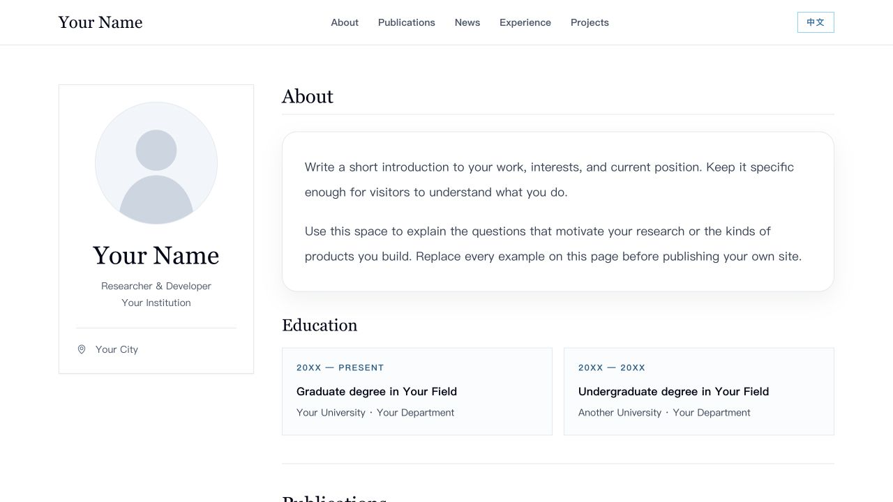

# Academic Portfolio Template

A clean, responsive, bilingual (English / 中文) personal website template for researchers, students, and developers. Built with React, Vite, and Tailwind CSS. It includes an editorial profile card, education, publications, news, experience, projects, and contact sections.

[中文文档](README.zh-CN.md)



> All names, institutions, publications, positions, and projects shown in the starter site are fictional examples. The included avatar is a generic vector placeholder.

## Features

- English and Chinese content in one file, with an instant language switch.
- Publications with an emphasized primary author, optional metrics, and optional paper and code links.
- Responsive layout with a profile card and clearly separated sections.
- Optional sections: set a section's array to `[]` to hide it.
- GitHub Pages workflow included. The Vite base path automatically follows the repository name, including forks and repositories created from this template.
- No analytics, trackers, externally loaded fonts, image CDNs, or runtime API calls.

## Quick start

Requirements: Node.js 20.19+ or 22.12+ and npm. The deployment workflow uses Node.js 24.

```bash
npm ci
npm run dev
```

Open the local URL printed by Vite. To create a production build:

```bash
npm run build
npm run preview
```

## Make it yours

Most edits happen in [src/content.js](src/content.js). Replace the fictional entries in **both** `en` and `zh` with your own content.

| What to change | Where |
| --- | --- |
| Name, role, institution, location, biography | `content.en` and `content.zh` in `src/content.js` |
| Email and GitHub profile URL | `site.email` and `site.github` in `src/content.js` |
| Avatar | Replace `public/avatar.svg` and update `site.avatar` if the filename changes |
| Education, publications, news, experience, projects | The corresponding arrays in each language block |
| Default language | `site.defaultLanguage` (`"en"` or `"zh"`) |
| Browser title and search description | `index.html` |
| Colors, spacing, typography | Tailwind classes in `src/Portfolio.jsx` and `src/styles.css` |

Each section is data driven. For example, add a publication like this in each language block:

```js
{
  status: "Preprint",
  title: "Your Paper Title",
  authorName: "Your Name",
  coauthors: ", Collaborator Name",
  venue: "Venue · 20XX",
  summary: "What problem did the paper solve?",
  metrics: [{ value: "00", label: "Example metric" }],
  paperUrl: "https://example.org/paper",
  codeUrl: "https://example.org/code"
}
```

Set a URL to `""` to hide its button. Set `metrics` to `[]` to hide the metric row. Set the `publications`, `news`, `experience`, or `projects` array to `[]` to hide that section and its navigation link. The `about` section always appears; education can be hidden with `education: []`.

Before publishing, replace the sample copy, remove entries you do not need, add your own links, and check every page in both languages. Do not use `example.org` URLs as real project links.

## Publish with GitHub Pages

1. Click **Use this template** on GitHub and create a new repository.
2. In your new repository, open **Settings → Pages** and choose **GitHub Actions** as the build and deployment source.
3. Edit `src/content.js`, `public/avatar.svg`, and `index.html`; commit and push to `main`.
4. Wait for **Actions → Deploy portfolio to GitHub Pages** to succeed. The public URL will normally be `https://<username>.github.io/<repository>/`.

The build derives its base path from GitHub Actions' `GITHUB_REPOSITORY`. A repository named `<username>.github.io` uses `/`. To override the path for another host, set `VITE_BASE_PATH` during build (for example, `VITE_BASE_PATH=/ npm run build`). If you use a custom domain, add its usual GitHub Pages configuration separately.

## Project structure

```text
src/content.js       bilingual example data and site settings
src/Portfolio.jsx     reusable page components
src/styles.css        Tailwind imports and font stacks
public/avatar.svg     generic placeholder avatar
vite.config.js        automatic GitHub Pages base path
.github/workflows/    build and deployment workflow
```

## Search and accessibility checklist

- Replace the `<title>` and description in `index.html` with a concise description of your own page.
- Add accurate repository description and topics on GitHub, such as `academic-portfolio`, `personal-website`, `researcher-portfolio`, `react`, `vite`, and `github-pages`.
- Replace the placeholder avatar with an image you have permission to publish; update its alternative text if needed.
- Check the desktop and mobile layout, all navigation links, and both language versions before sharing the URL.

The starter site is crawlable (`public/robots.txt` allows indexing). Search engines decide when and whether to index a deployed copy; a repository description and topics help people find the source on GitHub.

## License

MIT. See [LICENSE](LICENSE).
